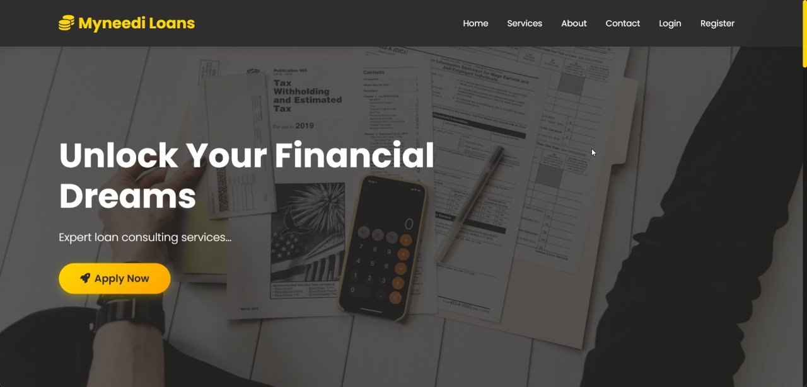
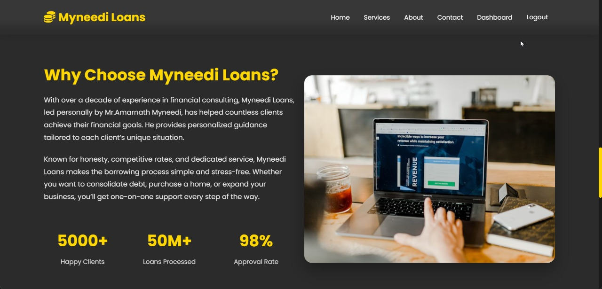
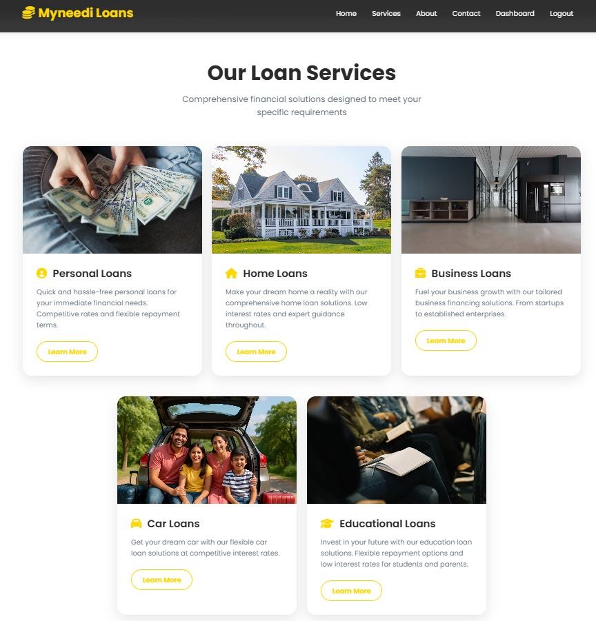
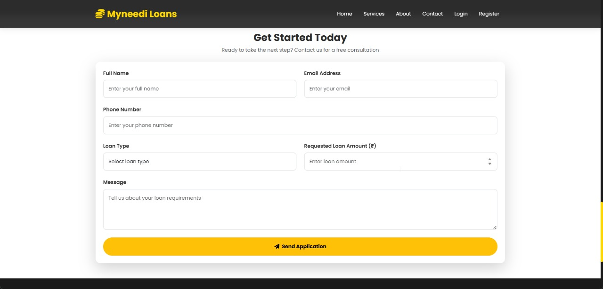
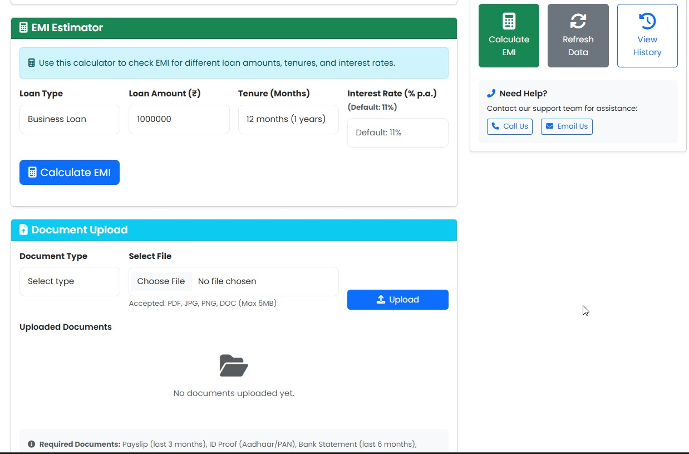
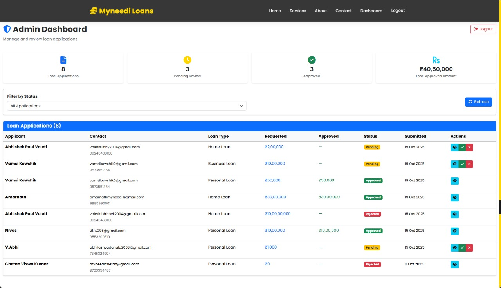

# 💰 Loan Application System

<div align="center">


### 🚀 A Modern, Secure & User-Friendly Loan Application Platform

[Live Demo](https://loan-project-chi.vercel.app) • [Backend API](https://loan-backend-uatr.onrender.com) • [Report Bug](../../issues) • [Request Feature](../../issues)

</div>

---

## 📋 Table of Contents

- [About The Project](#-about-the-project)
- [Live Demo](#-live-demo)
- [Tech Stack](#-tech-stack)
- [Key Features](#-key-features)
- [Screenshots](#-screenshots)
- [Getting Started](#-getting-started)
- [Backend Integration](#-backend-integration)
- [Project Structure](#-project-structure)
- [Contributing](#-contributing)
- [License](#-license)
- [Contact](#-contact)

---

## 🎯 About The Project

The **Loan Application System** is a comprehensive full-stack web application designed to streamline the loan application process. Built with modern technologies, it provides an intuitive interface for users to apply for loans and administrators to manage applications efficiently.

### Why This Project?

✅ **Secure Authentication** - Role-based access control for users and admins  
✅ **Real-time Validation** - Instant feedback on form inputs  
✅ **Responsive Design** - Works seamlessly on all devices  
✅ **RESTful API Integration** - Clean separation of frontend and backend  
✅ **Production Ready** - Deployed on Vercel with CI/CD

---

## 🌐 Live Demo

🔗 **Frontend:** [https://loan-project-chi.vercel.app](https://loan-project-chi.vercel.app)

🔗 **Backend API:** [https://loan-backend-uatr.onrender.com](https://loan-backend-uatr.onrender.com)

> **Note:** The backend may take 30-60 seconds to wake up on first request (free tier hosting).

---

## 🛠 Tech Stack

### Frontend


### Backend


### Deployment


---

## ✨ Key Features

### 👤 User Features

- 📝 **Easy Registration** - Quick and simple user onboarding
- 🔐 **Secure Login** - JWT-based authentication
- 💳 **Loan Application** - Comprehensive loan application forms
- 📊 **Application Dashboard** - Track loan application status
- ✅ **Real-time Validation** - Instant feedback on form inputs
- 📱 **Responsive Design** - Mobile-friendly interface

### 👨‍💼 Admin Features

- 🗂 **Application Management** - View and manage all loan applications
- ✏️ **Status Updates** - Approve, reject, or request more information
- 📈 **Analytics Dashboard** - Overview of application statistics
- 🔍 **Search & Filter** - Easy navigation through applications
- 📧 **Email Notifications** - Automated email updates to applicants

### 🔧 Technical Features

- ⚡ **Fast Performance** - Built with Vite for lightning-fast builds
- 🎨 **Modern UI/UX** - Clean and intuitive interface
- 🔄 **API Integration** - RESTful API communication
- 🛡 **Error Handling** - Comprehensive error management
- 📦 **Modular Code** - Easy to maintain and extend

---

## 📸 Screenshots

### 🏠 Landing Page


### 🌟 About Section


### 💼 Services Page


### 📝 Application Form


### 👤 User Dashboard



### 🛡️ Admin Dashboard


## 🚀 Getting Started

### Prerequisites

Make sure you have the following installed:

- **Node.js** (v16 or higher)
- **npm** or **yarn**
- **Git**

### Installation

1. **Clone the repository**

```bash
git clone https://github.com/ChetanVK10/Loan-Project.git
cd Loan-Project
```

2. **Install dependencies**

```bash
npm install
# or
yarn install
```

3. **Set up environment variables**

Create a `.env` file in the root directory:

```env
VITE_API_URL=https://loan-backend-uatr.onrender.com
# or use your local backend
# VITE_API_URL=http://localhost:5000
```

4. **Run the development server**

```bash
npm run dev
# or
yarn dev
```

5. **Open your browser**

Navigate to `http://localhost:5173` to see the application running.

### Build for Production

```bash
npm run build
# or
yarn build
```

The build files will be generated in the `dist` folder.

### Preview Production Build

```bash
npm run preview
# or
yarn preview
```

---

## 🔗 Backend Integration

This frontend application is integrated with a Node.js/Express backend that handles:

- 🔐 **Authentication & Authorization** - JWT-based secure authentication
- 💾 **Database Operations** - MongoDB for data persistence
- 📧 **Email Notifications** - Automated email updates
- 🔒 **Data Validation** - Server-side validation for security
- 📊 **API Endpoints** - RESTful API for all operations

### Backend Repository

🔗 **Backend Code:** [Coming Soon]

### API Endpoints

| Method | Endpoint | Description |
|--------|----------|-------------|
| POST | `/api/auth/register` | User registration |
| POST | `/api/auth/login` | User login |
| GET | `/api/loans` | Get all loan applications |
| POST | `/api/loans` | Submit loan application |
| PUT | `/api/loans/:id` | Update loan status |
| DELETE | `/api/loans/:id` | Delete loan application |

---

## 📁 Project Structure

```
Loan-Project/
├── public/              # Static assets
├── src/
│   ├── components/      # Reusable React components
│   ├── pages/          # Page components
│   ├── services/       # API service functions
│   ├── styles/         # CSS stylesheets
│   ├── utils/          # Utility functions
│   ├── App.jsx         # Main App component
│   └── main.jsx        # Entry point
├── .gitignore
├── index.html
├── package.json
├── vite.config.js      # Vite configuration
└── README.md
```

---

## 🤝 Contributing

Contributions are what make the open-source community such an amazing place to learn, inspire, and create. Any contributions you make are **greatly appreciated**.

1. Fork the Project
2. Create your Feature Branch (`git checkout -b feature/AmazingFeature`)
3. Commit your Changes (`git commit -m 'Add some AmazingFeature'`)
4. Push to the Branch (`git push origin feature/AmazingFeature`)
5. Open a Pull Request

---

## 📜 License

Distributed under the MIT License. See `LICENSE` file for more information.

---

## 📞 Contact

**Chetan VK**

- GitHub: [@ChetanVK10](https://github.com/ChetanVK10)
- Project Link: [https://github.com/ChetanVK10/Loan-Project](https://github.com/ChetanVK10/Loan-Project)

---

<div align="center">

### ⭐ Star this repo if you find it helpful!

**Made with ❤️ by Chetan VK**

</div>
